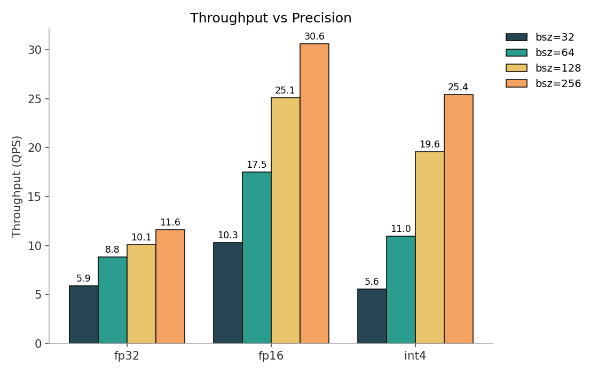
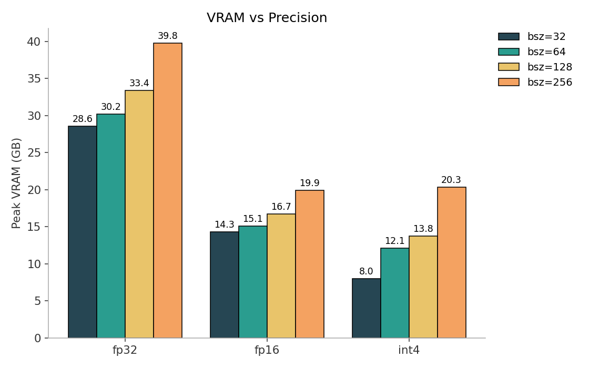
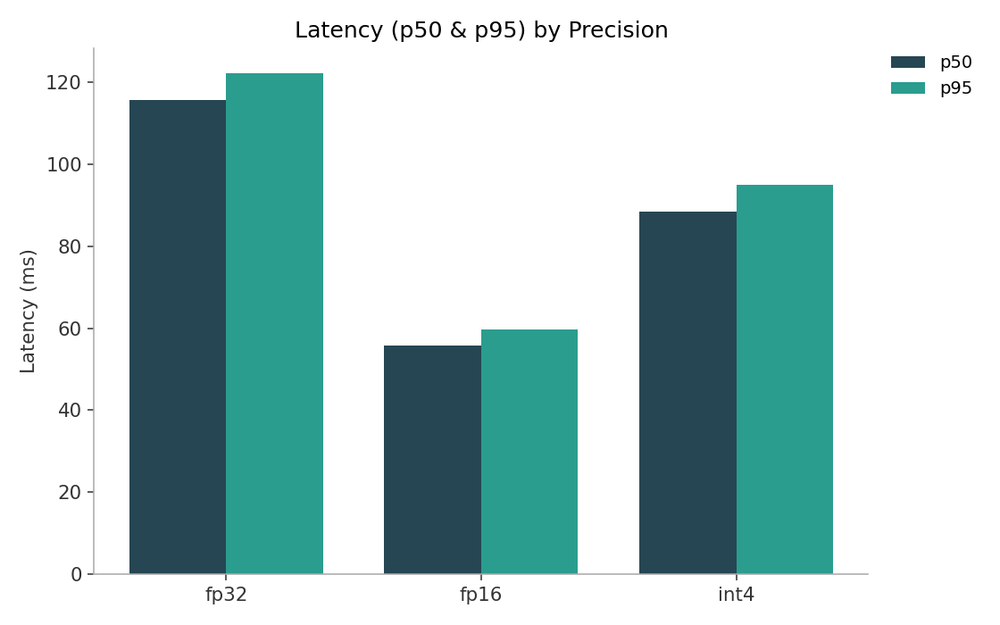
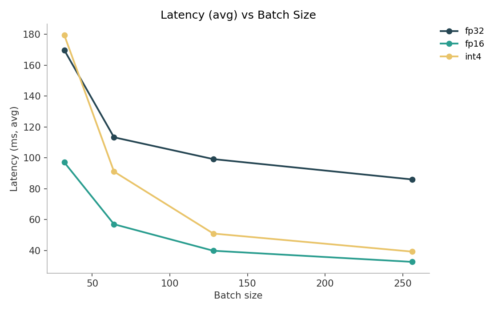
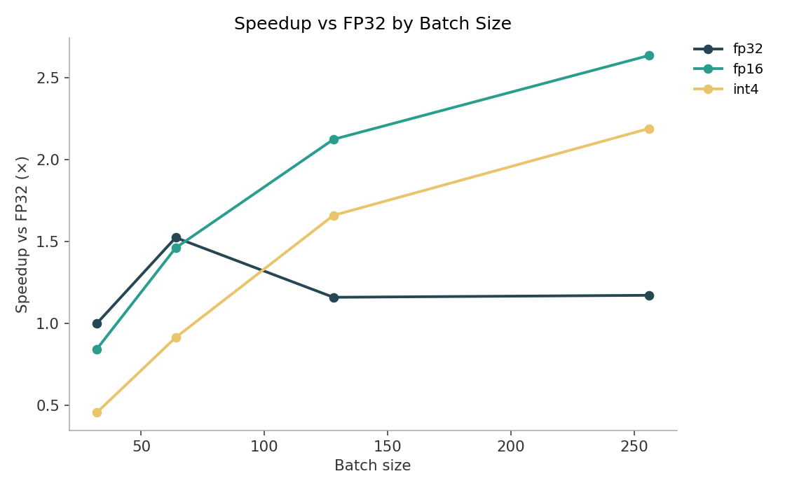
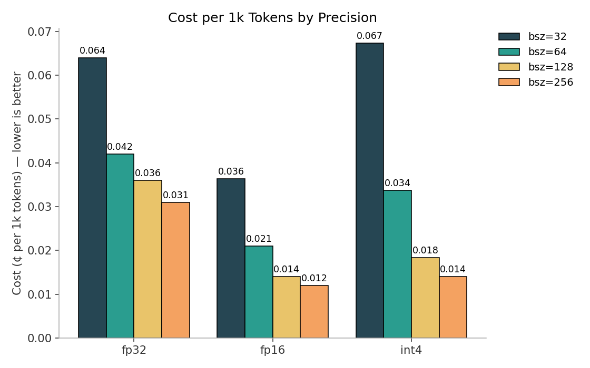
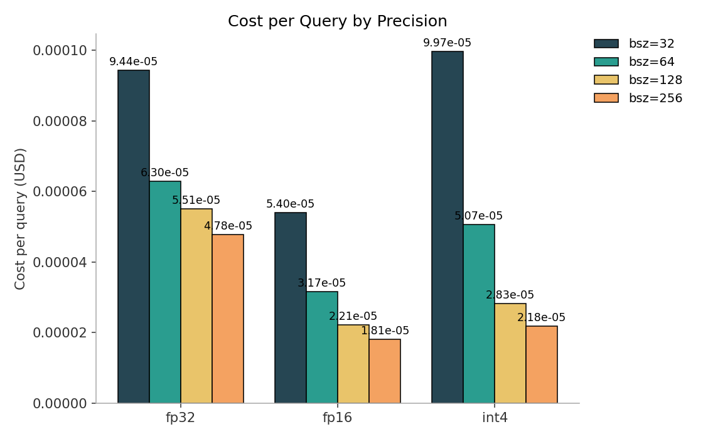
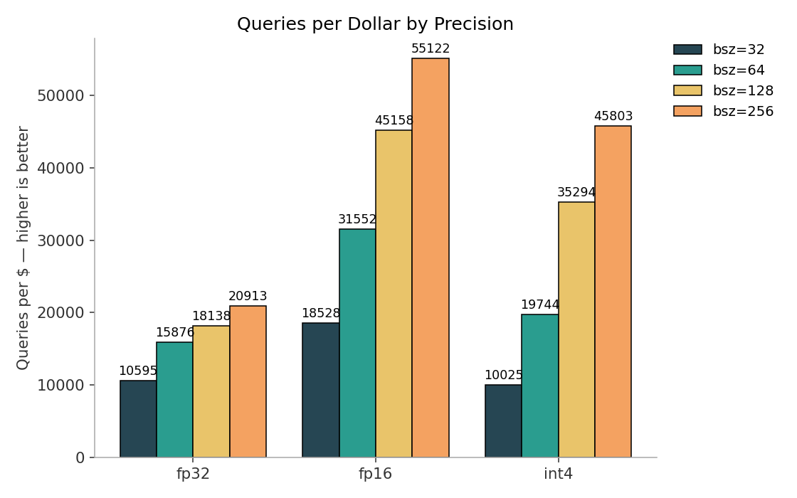

# Quantization
> Quantization (FP16/INT4) delivers ~2–3× throughput with ~50% lower latency and up to ~70% less VRAM vs FP32.

## Inspiration
I wanted to deepen my understanding of techniques that impact **inference efficiency**. One area I explored was **quantization**, which I first came across in [NVIDIA's *Mastering LLM Techniques: Inference Optimization*](https://developer.nvidia.com/blog/mastering-llm-techniques-inference-optimization/). Quantization is a model optimization approach that reduces GPU memory usage by lowering the precision of model weights (e.g., from FP32 to FP16 or INT4), enabling faster and more efficient inference.

## Introduction
Quantization is a model optimization technique that reduces the numerical precision of parameters and activations, such as converting 32-bit floating point (FP32) weights into 16-bit (FP16) or 4-bit (INT4) representations. This compression reduces the memory footprint of large models, making them easier to deploy on limited hardware while preserving most of their predictive accuracy.  

From a business standpoint, inference efficiency is critical because serving large models at scale drives up GPU costs and affects latency-sensitive applications. Quantization helps address these challenges by **reducing hardware costs**, **improving throughput**, **lowering energy consumption**, and **making deployment more scalable**, all while often maintaining comparable levels of accuracy. These benefits allow organizations to deliver AI systems more quickly and cost-effectively, turning cutting-edge research into practical, real-world products.

## Dataset (PubMedQA)

## Models

## Workflow

## Metrics

## Results: Table, Performance
| Batch | Precision | QPS | Tokens/sec | p95 Latency (ms) | Peak VRAM (GB) |
| ---: | --- | ---: | ---: | ---: | ---: |
| 32 | fp16 | 10 | 1.52K | 99 | 14.30 |
| 32 | fp32 | 6 | 872 | 173 | 28.59 |
| 32 | int4 | 6 | 825 | 177 | 8.01 |
| 64 | fp16 | 18 | 2.64K | 66 | 15.11 |
| 64 | fp32 | 9 | 1.33K | 126 | 30.19 |
| 64 | int4 | 11 | 1.65K | 109 | 12.11 |
| 128 | fp16 | 25 | 3.84K | 41 | 16.71 |
| 128 | fp32 | 10 | 1.54K | 103 | 33.39 |
| 128 | int4 | 20 | 3.00K | 54 | 13.78 |
| 256 | fp16 | 31 | 4.76K | 33 | 19.93 |
| 256 | fp32 | 12 | 1.81K | 87 | 39.79 |
| 256 | int4 | 25 | 3.96K | 40 | 20.35 |

* **FP16 is the clear winner across all batches—QPS roughly doubles or better (e.g., 12→31 at bsz=256), p95 latency is about half of FP32, and VRAM drops by ~50%**. INT4 matches or beats FP32 from bsz≥64 (1.2–2.2× QPS) while cutting peak VRAM by ~50–70%; at bsz=32 it ties FP32 on QPS with ~72% less VRAM and similar latency.*

## Results: Visuals
 
 ---
 
### Precision:

***Throughput increases as precision is reduced, with FP16 providing the best performance across all batch sizes — peaking at ~30.6 QPS with batch size 256, nearly 3× faster than FP32***. *INT4 delivers lower throughput at small batch sizes but scales effectively, surpassing FP32 and approaching FP16 as the batch size grows. These results highlight that precision reduction, especially FP16, can significantly boost inference speed when workloads are scaled.*

***VRAM usage decreases significantly with lower precision***. *FP32 peaks near 40 GB at batch size 256, while FP16 cuts memory roughly in half, and INT4 reduces it even further — dropping as low as 8 GB at batch size 32. These results show that quantization not only improves efficiency but also enables serving larger batch sizes within the same GPU memory budget, making deployment more scalable and cost-effective.*

***Quantization reduces both median (p50) and tail (p95) latency compared to FP32.*** *FP16 achieves the lowest latencies overall, with p50 around 55 ms and p95 near 60 ms, while INT4 performs better than FP32 but remains higher than FP16. These results highlight that reduced precision not only improves average performance but also tightens latency distribution, making inference more predictable at scale.*

---

### Batch Sizes:

***Latency decreases as batch size increases, with lower precision formats providing the best improvements***. *FP16 consistently achieves the lowest latency, dropping to ~32 ms at batch size 256, while INT4 starts higher but converges closer to FP16 as batch size grows. FP32 remains the slowest across all batch sizes, underscoring how precision reduction not only boosts throughput but also reduces response times for inference.*

***Quantization delivers clear speedups over FP32 as batch size grows.*** *FP16 provides the strongest gains, reaching ~2.6× faster than FP32 at batch size 256, while INT4 shows steady improvements, achieving ~2.2× at the same scale. These results highlight that precision reduction not only lowers memory and latency but also translates directly into faster inference throughput relative to the FP32 baseline.*

---

### Costs:

***Cost per 1k tokens decreases significantly with lower precision.*** *FP32 is the most expensive, reaching ~0.064¢ at batch size 32, while FP16 cuts costs by more than half, dropping to ~0.012¢ at batch size 256. INT4 shows higher costs than FP16 at small batch sizes but converges close at larger scales. These results demonstrate that quantization not only improves performance but also delivers substantial cost savings when serving large-scale inference.*

***Relative to FP32, quantization delivers substantial cost savings.*** *FP16 achieves the largest gains, cutting costs by ~43–62% depending on batch size, with the biggest savings at batch size 256. INT4 shows mixed results: it is less efficient at very small batch sizes (even negative savings at bsz=32), but scales strongly, reaching ~54% savings at bsz=256. These results highlight FP16 as the most reliable option for cost reduction, while INT4 can match or exceed savings once workloads are large enough.*

***Quantization greatly improves the number of queries that can be served per dollar.*** *FP16 delivers the best efficiency, scaling from ~18k queries/$ at batch size 32 to over 55k queries/$ at batch size 256. INT4 starts off less efficient at small batches but scales strongly, reaching ~46k queries/$ at large batch sizes, well above FP32. These results highlight that precision reduction directly translates into higher cost efficiency when deploying at scale.*

## Results: Table, Statisitical Tests
### QPS vs FP32 — per batch
| Batch | Precision | Direction | × vs FP32 | 95% CI | p(two-sided) |
| ---: | --- | --- | ---: | --- | ---: |
| 32 | fp16 | faster | ×1.75 | 1.74–1.76 | 1.8e-09 |
| 32 | int4 | slower | ×0.95 | 0.94–0.96 | 6.3e-04 |
| 64 | fp16 | faster | ×1.99 | 1.97–2.00 | 3.4e-08 |
| 64 | int4 | faster | ×1.24 | 1.23–1.26 | 7.7e-05 |
| 128 | fp16 | faster | ×2.49 | 2.49–2.49 | <1e-12 |
| 128 | int4 | faster | ×1.95 | 1.92–1.97 | 1.6e-05 |
| 256 | fp16 | faster | ×2.64 | 2.62–2.65 | 1.0e-06 |
| 256 | int4 | faster | ×2.19 | 2.18–2.20 | 6.9e-07 |

*The effect scales with batch size:* ***FP16 delivers ~2–2.6× at 64–256***, *with ultra-tight CIs and p-values ≪ 1e-6—rock-solid wins. INT4 is the only miss at bsz=32 (0.95×), but turns decisively faster from bsz≥64 (1.24–2.19×), also with strong significance.* 

*In short:* ***bigger batches amplify quantization’s throughput advantage***, *with FP16 winning across the board and INT4 paying off once you batch.*

### QPS vs FP32 — across batches (geo-mean)
| Precision | Direction | × vs FP32 (geo-mean) | 95% CI | p(combined) |
| --- | --- | ---: | --- | ---: |
| fp16 | faster | ×2.19 | 1.81–2.64 | <1e-12 |
| int4 | faster | ×1.50 | 1.02–2.19 | <1e-12 |

***Both effects are statistically decisive*** *(p < 1e−12); FP16 shows the strongest, most reliable lift, while INT4 delivers a solid overall gain.*

## Next Steps

## Conclusion

## Tech Stack

